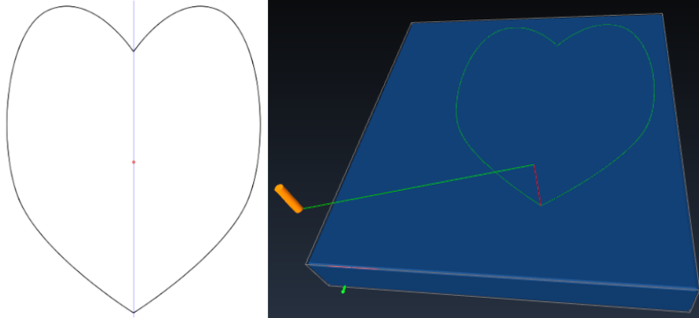

# [GCODEPLOT](https://github.com/arpruss/gcodeplot): (.svg) &#8594; (gcode)



Convert SVG (text is not supported; convert text to paths) and HPGL to gcode for a 3-axis GCode machine, 
where the Z-axis controls the pen height.

You can also convert the same SVG subset to HPGL.

Run with no arguments for some help.

Note on multiple pen usage:

The pen definition file is one-pen per line, in the format:

```
n (x,y) svgcolor comment
```

Here, n is the pen number (pen 1 is assumed to be loaded at the start), (x,y) is the offset from the 
default pen position (note: `gcodeplot.py` will correct the offset and will NOT check for clipping at 
drawing edges--it is your responsibility to make sure your tool doesn't crash into anything due to 
offset), svgcolor is a color specification in svg format, e.g., rgb(255,255,00), #FFFF00 or yellow, 
and the comment is a human-readable comment.

## Ejemplo

1. Obtener gcode

	```sh
	$ python3 gcodeplot.py heart.svg >output
	```

2. modificar gcode

	```sh
	$ vim output
	```

	* eliminar estas primeras lineas

		```
		G00 S1; endstops
		G00 E0; no extrusion
		G01 S1; endstops
		G01 E0; no extrusion
		G21; millimeters
		G91 G0 F300.0 Z20.000; pen park !!Zsafe
		G90; absolute
		G28 X; home
		G28 Y; home
		G28 Z; home
		G00 F300.0 Z34.500; pen park !!Zpark
		G00 F2400.0 Y8.000; !!Ybottom
		G00 F2400.0 X7.000; !!Xleft
		```

	* agregar esto en la ultima linea

		```
		G01 X0.0 Y0.0
		```
