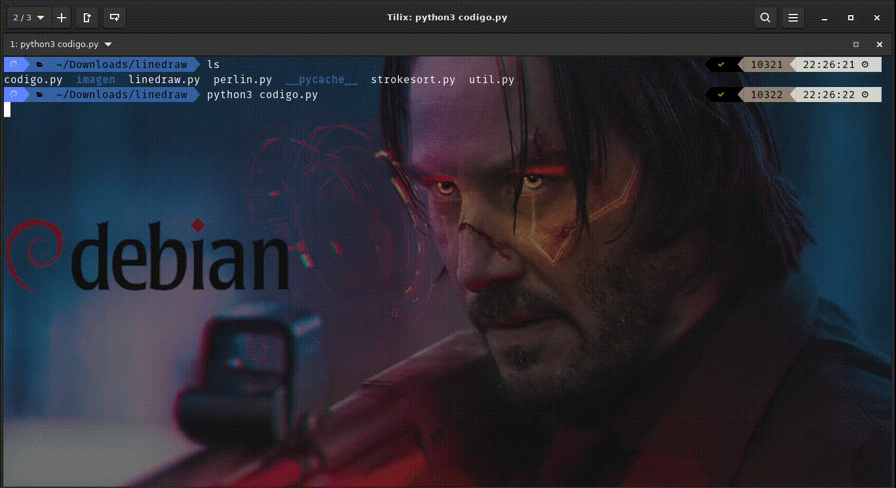

# [linedraw](https://github.com/LingDong-/linedraw) : (jpg,png) &#8594; (.svg)

## Instalacion

```
$ pip3 install filters
```

## Command specs:

```
usage: linedraw.py [-h] [-i [INPUT_PATH]] [-o [OUTPUT_PATH]] [-b] [-nc] [-nh]
                   [--no_cv] [--hatch_size [HATCH_SIZE]]
                   [--contour_simplify [CONTOUR_SIMPLIFY]]

Convert image to vectorized line drawing for plotters.

optional arguments:
  -h, --help            show this help message and exit
  -i [INPUT_PATH], --input [INPUT_PATH]
                        Input path
  -o [OUTPUT_PATH], --output [OUTPUT_PATH]
                        Output path.
  -b, --show_bitmap     Display bitmap preview.
  -nc, --no_contour     Don't draw contours.
  -nh, --no_hatch       Disable hatching.
  --no_cv               Don't use openCV.
  --hatch_size [HATCH_SIZE]
                        Patch size of hatches. eg. 8, 16, 32
  --contour_simplify [CONTOUR_SIMPLIFY]
                        Level of contour simplification. eg. 1, 2, 3
```

## Archivos necesarios

```bash
.
├── input
│   └── rana.png
├── linedraw.py
├── perlin.py
├── strokesort.py
└── util.py
```

## Ejemplos

1. simple

	```
	$ python3 linedraw.py -i input.jpg -o output.svg
	```

	| input				| output			|
	|-------------------------------|-------------------------------|
	| 		| 	|

2. visualizar resultado final de bitmap

	```
	$ python3 linedraw.py -i input/rana.png -o rana.svg -b 
	```

3. sin contorno

	```
	$ python3 linedraw.py -i input/rana.png -o rana.svg -nc 
	```

	| input				| output				|
	|-------------------------------|---------------------------------------|
	| 		| 	|

4. sin hatching

	```
	$ python3 linedraw.py -i input/rana.png -o rana.svg -nh
	```

	| input				| output		|
	|-------------------------------|-----------------------|
	| 		| 	|

5. hatch size

	```
	$ python3 linedraw.py  -i input/rana.png -o rana.svg --hatch_size 8
	```

	| input				| output			|
	|-------------------------------|-------------------------------|
	| 		| 	|

	```
	$ python3 linedraw.py  -i input/rana.png -o rana.svg --hatch_size 64
	```

	| input				| output			|
	|-------------------------------|-------------------------------|
	| 		| 	|

6. level of contour simplification (--contour-simplify 1,2,3)

	```
	$ python3 linedraw.py -i input/rana.png -o rana.svg --contour_simplify 1
	```

	| input				| output			|
	|-------------------------------|-------------------------------|
	| 		| 	|

	```
	$ python3 linedraw.py -i input/rana.png -o rana.svg --contour_simplify 2
	```

	| input			| output			|
	|-----------------------|-------------------------------|
	| 	| 	|

## Simular dibujo en tiempo real

* archivos necesarios
	```bash
	.
	├── codigo.py
	├── input
	│   └── rana.png
	├── linedraw.py
	├── perlin.py
	├── strokesort.py
	└── util.py
	```

* `codigo.py`

	```py
	import linedraw
	lines = linedraw.sketch("imagen/rana.png")  # return list of polylines, eg.
						    # [[(x,y),(x,y),(x,y)],[(x,y),(x,y),...],...]
						    
	linedraw.visualize(lines)                   # simulates plotter behavior
						    # draw the lines in order using turtle graphics.
	```

* Ejecutar

	```
	$ python3 codigo.py
	```

	
