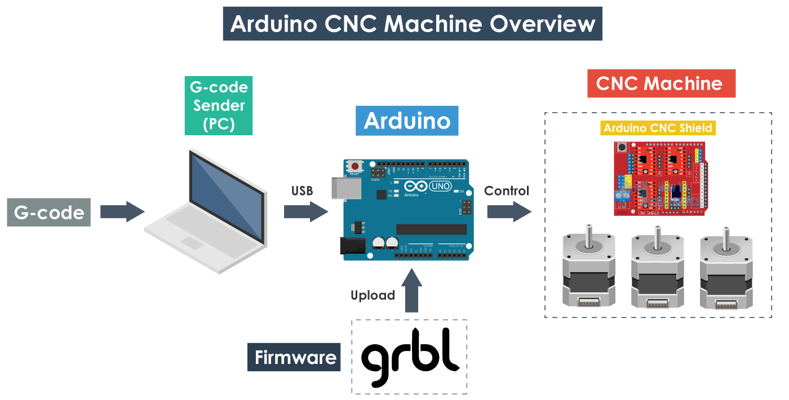

# GRBL



## Cargar firmware grbl a arduino
1. Descomprimir

	```sh
	$ unzip grbl-1.1f.20170801.zip
	```

2. Copiar la carpeta grbl y ponerla con las demas librerias de arduino

	```sh
	$ cd grbl-1.1f.20170801
	```

    a. Si has instalado **Arduino** usando apt

        ```sh
        $ sudo cp -r grbl /usr/share/arduino/libraries/
        ```

    b. Si estas usando un AppImage de **Arduino**

        ```sh
        $ cp -r grbl ~/Arduino/libraries
        ```

3. Abrimos el IDE de arduino y seleccionamos: **File -> Examples -> grbl -> grblUpload**
4. Cargamos este ejemplo al arduino y listo.
*******
